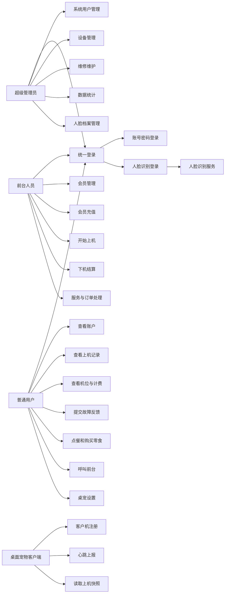

# 论文设计与开发问题总结

编写日期：2026-09-01

## 1. 文档目的

本文档用于支撑“网咖综合管理系统”的课程设计、毕业论文或项目答辩材料，集中整理系统用例关系设计、用例表设计、数据库表设计、核心业务流程、非功能设计，以及开发过程中遇到的问题和解决方案。

系统当前采用三角色模型：超级管理员、前台人员、普通用户。三个角色共用统一登录入口，但登录后进入各自独立的功能门户。业务数据统一保存到 MySQL，前端页面、后端接口、人脸服务和桌面宠物通过接口进行互联互通。

## 2. 系统总体设计

### 2.1 系统定位

本系统面向网咖、电竞馆和中小型上机场景，目标是完成会员、设备、上机计费、前台服务、商品点餐、人脸认证、维修维护和桌面宠物提醒等业务闭环。

系统重点解决以下问题：

- 前台需要实时掌握机位状态、会员余额和上机情况。
- 管理员需要维护用户权限、设备、维修和经营统计。
- 普通用户需要查看自身账户、上机状态、呼叫前台、点餐和控制桌面宠物。
- 系统需要通过数据库保证余额、订单、会话、库存和维修记录真实有效。

### 2.2 技术架构

| 层级 | 技术 | 主要职责 |
| --- | --- | --- |
| 前端网页端 | Vue 3、Vite、TypeScript、Element Plus | 统一登录、三角色门户、管理端页面和普通用户页面 |
| 后端服务 | Spring Boot 3、Spring Security、JdbcTemplate | REST API、权限校验、业务事务、数据库访问 |
| 数据库 | MySQL 8 | 保存系统用户、会员、设备、计费、订单、流水和人脸档案 |
| 人脸服务 | FastAPI、OpenCV | 人脸检测、质量评分、特征提取、识别和验证 |
| 桌面宠物 | Electron、Vue 3 | 客户机上机状态展示、余额提醒、休息提醒和用户偏好同步 |
| 仓库管理 | Git、GitHub | 代码版本管理、文档归档、多人或多端同步 |

### 2.3 部署关系

```text
GitHub 仓库
  └── 同步代码、文档、脚本

本机服务器
  ├── Vue 前端服务
  ├── Spring Boot 后端服务
  ├── MySQL 数据库
  ├── FastAPI 人脸服务
  └── Electron 桌宠客户端接口

同一局域网访问端
  ├── 超级管理员浏览器
  ├── 前台人员浏览器
  └── 普通用户浏览器或客户机桌宠
```

## 3. 角色与权限设计

### 3.1 角色划分

| 角色 | 角色编码 | 职责范围 |
| --- | --- | --- |
| 超级管理员 | `super_admin` | 管理系统用户、权限、会员、设备、维修维护、人脸认证、计费规则和经营统计 |
| 前台人员 | `front_desk` | 负责会员充值、开机、结算、设备监控、服务呼叫、订单处理和人脸录入辅助 |
| 普通用户 | `customer` | 查看个人账户、上机记录、机位信息、提交故障、呼叫前台、点餐和桌宠设置 |

### 3.2 权限边界

| 权限编码 | 权限名称 | 超级管理员 | 前台人员 | 普通用户 |
| --- | --- | --- | --- | --- |
| `dashboard:view` | 经营看板 | 是 | 是 | 否 |
| `workbench:view` | 前台工作台 | 是 | 是 | 否 |
| `member:manage` | 会员管理 | 是 | 是 | 否 |
| `device:manage` | 设备管理 | 是 | 否 | 否 |
| `device:view` | 设备监控 | 否 | 是 | 否 |
| `billing:manage` | 计费规则 | 是 | 是 | 否 |
| `session:view` | 上机记录 | 是 | 是 | 否 |
| `face:manage` | 人脸认证 | 是 | 是 | 否 |
| `service:manage` | 服务与订单 | 是 | 是 | 否 |
| `statistics:view` | 数据统计 | 是 | 否 | 否 |
| `system:user` | 系统用户 | 是 | 否 | 否 |
| `maintenance:manage` | 维修维护 | 是 | 否 | 否 |
| `portal:home` | 我的首页 | 否 | 否 | 是 |
| `portal:account` | 我的账户 | 否 | 否 | 是 |
| `portal:sessions` | 我的上机记录 | 否 | 否 | 是 |
| `portal:devices` | 机位与计费 | 否 | 否 | 是 |
| `portal:support` | 故障反馈 | 否 | 否 | 是 |
| `portal:services` | 呼叫与点餐 | 否 | 否 | 是 |

## 4. 用例关系设计

### 4.1 参与者

| 参与者 | 说明 |
| --- | --- |
| 超级管理员 | 系统最高权限用户，负责系统配置、数据维护和维修处理 |
| 前台人员 | 门店运营人员，负责会员、上机、结算、订单和服务呼叫 |
| 普通用户 | 会员本人，使用用户门户查询个人数据并发起服务请求 |
| 人脸识别服务 | 外部业务服务，负责接收图片并返回识别或验证结果 |
| 桌面宠物客户端 | 客户机本地程序，读取当前会话状态并展示提醒 |
| MySQL 数据库 | 数据持久化参与者，保存所有真实业务数据 |

### 4.2 总体用例关系



### 4.3 用例包含与扩展关系

| 主用例 | 关系 | 子用例或扩展用例 | 说明 |
| --- | --- | --- | --- |
| 统一登录 | 包含 | 账号密码登录 | 所有角色均可使用账号密码登录 |
| 统一登录 | 扩展 | 人脸识别登录 | 已录入人脸档案的用户可选择人脸登录 |
| 会员管理 | 包含 | 会员注册 | 新增会员基础资料 |
| 会员管理 | 包含 | 会员充值 | 修改余额并生成充值记录和账户流水 |
| 开始上机 | 包含 | 校验会员状态 | 冻结会员不能上机 |
| 开始上机 | 包含 | 校验设备状态 | 只有空闲设备可以分配 |
| 开始上机 | 包含 | 生成上机会话 | 写入 `machine_session` 并更新设备为使用中 |
| 下机结算 | 包含 | 计算费用 | 按计费规则计算实际扣费 |
| 下机结算 | 包含 | 扣减余额 | 更新账户余额、消费记录和账户流水 |
| 下机结算 | 包含 | 释放设备 | 会话结束后设备恢复空闲 |
| 点餐下单 | 包含 | 查询商品库存 | 商品必须启用且库存充足 |
| 点餐下单 | 包含 | 余额支付 | 使用会员预存网费支付 |
| 点餐下单 | 包含 | 扣减库存 | 支付成功后减少商品库存 |
| 取消订单 | 扩展 | 自动退款 | 取消未完成订单时退回余额并恢复库存 |
| 呼叫前台 | 包含 | 关联当前机位 | 存在上机会话时自动绑定设备 |
| 故障反馈 | 包含 | 生成故障记录 | 普通用户提交后管理员处理 |
| 桌宠显示 | 包含 | 获取会话快照 | 根据设备编号读取当前上机数据 |
| 桌宠显示 | 扩展 | 低余额提醒 | 余额低于阈值时展示提醒 |
| 桌宠设置 | 包含 | 显示开关 | 普通用户可控制桌宠是否显示 |

## 5. 用例表设计

### 5.1 UC-01 统一登录

| 项目 | 内容 |
| --- | --- |
| 用例名称 | 统一登录 |
| 参与者 | 超级管理员、前台人员、普通用户 |
| 前置条件 | 用户账号存在且状态为启用 |
| 后置条件 | 系统签发 JWT，前端根据角色进入对应门户 |
| 基本流程 | 输入账号密码或上传人脸图片，后端校验身份，查询角色权限，返回令牌和用户信息 |
| 异常流程 | 密码错误、账号停用、人脸未录入、人脸服务不可用、相似度不足 |
| 涉及表 | `sys_user`、`sys_user_role`、`sys_role`、`sys_permission`、`sys_role_permission`、`face_profile`、`face_verify_log` |

### 5.2 UC-02 系统用户管理

| 项目 | 内容 |
| --- | --- |
| 用例名称 | 系统用户管理 |
| 参与者 | 超级管理员 |
| 前置条件 | 超级管理员已登录并拥有 `system:user` 权限 |
| 后置条件 | 系统用户创建、角色绑定或密码重置生效 |
| 基本流程 | 查询用户列表，选择角色，创建用户，重置密码，启停账号 |
| 异常流程 | 用户名重复、角色不存在、普通角色越权访问 |
| 涉及表 | `sys_user`、`sys_role`、`sys_user_role` |

### 5.3 UC-03 会员注册与资料维护

| 项目 | 内容 |
| --- | --- |
| 用例名称 | 会员注册与资料维护 |
| 参与者 | 超级管理员、前台人员 |
| 前置条件 | 操作员已登录并拥有 `member:manage` 权限 |
| 后置条件 | 新会员资料和资金账户创建成功 |
| 基本流程 | 填写姓名、手机号、身份证号、会员等级，保存会员资料，初始化会员账户 |
| 异常流程 | 会员编号重复、手机号格式不符合要求、数据库写入失败 |
| 涉及表 | `member_info`、`member_account` |

### 5.4 UC-04 会员充值

| 项目 | 内容 |
| --- | --- |
| 用例名称 | 会员充值 |
| 参与者 | 前台人员、超级管理员 |
| 前置条件 | 会员状态正常，操作员拥有会员管理权限 |
| 后置条件 | 余额增加，充值记录和账户流水同步生成 |
| 基本流程 | 选择会员，输入充值金额、赠送金额和支付方式，提交后更新账户余额 |
| 异常流程 | 会员不存在、充值金额无效、数据库事务失败 |
| 涉及表 | `member_account`、`recharge_record`、`member_account_flow` |

### 5.5 UC-05 开始上机

| 项目 | 内容 |
| --- | --- |
| 用例名称 | 开始上机 |
| 参与者 | 前台人员、超级管理员 |
| 前置条件 | 会员状态为 ACTIVE，设备状态为 IDLE，计费规则有效 |
| 后置条件 | 生成运行中上机会话，设备状态改为 IN_USE |
| 基本流程 | 选择会员、空闲机位和计费规则，校验会员和设备状态，写入会话 |
| 异常流程 | 会员被冻结、会员已有运行中会话、设备故障或维护中 |
| 涉及表 | `member_info`、`device_info`、`billing_rule`、`machine_session` |

### 5.6 UC-06 下机结算

| 项目 | 内容 |
| --- | --- |
| 用例名称 | 下机结算 |
| 参与者 | 前台人员、超级管理员 |
| 前置条件 | 存在运行中的上机会话 |
| 后置条件 | 会话结束、余额扣减、设备释放、消费记录和账户流水生成 |
| 基本流程 | 查询会话，按规则计算费用，锁定会员账户，扣费并结束会话 |
| 异常流程 | 会话已结算、余额不足、设备状态异常 |
| 涉及表 | `machine_session`、`billing_rule`、`member_account`、`consume_record`、`member_account_flow`、`device_info` |

### 5.7 UC-07 人脸录入与验证

| 项目 | 内容 |
| --- | --- |
| 用例名称 | 人脸录入与验证 |
| 参与者 | 超级管理员、前台人员、人脸识别服务 |
| 前置条件 | 用户账号存在，浏览器可上传摄像头图片 |
| 后置条件 | 人脸档案保存或验证日志生成 |
| 基本流程 | 选择用户，上传图片，人脸服务检测并提取特征，后端保存特征引用和质量分 |
| 异常流程 | 未检测到人脸、多张人脸、图片过大、质量过低、服务离线 |
| 涉及表 | `sys_user`、`member_info`、`face_profile`、`face_verify_log` |

### 5.8 UC-08 设备管理与维修维护

| 项目 | 内容 |
| --- | --- |
| 用例名称 | 设备管理与维修维护 |
| 参与者 | 超级管理员、普通用户 |
| 前置条件 | 管理员拥有设备维护权限，普通用户可提交故障反馈 |
| 后置条件 | 设备状态更新，维修记录可追踪 |
| 基本流程 | 管理员维护设备资料，用户提交故障，管理员处理并填写维修结果 |
| 异常流程 | 设备不存在、故障已处理、普通用户越权处理工单 |
| 涉及表 | `device_info`、`device_fault`、`repair_record` |

### 5.9 UC-09 普通用户点餐与购买零食

| 项目 | 内容 |
| --- | --- |
| 用例名称 | 点餐与购买零食 |
| 参与者 | 普通用户、前台人员 |
| 前置条件 | 普通用户已登录且绑定会员账户，商品处于启用状态 |
| 后置条件 | 订单生成，余额扣减，库存减少，前台可处理订单 |
| 基本流程 | 用户查看商品，加入购物车，使用预存余额支付，前台更新订单状态 |
| 异常流程 | 余额不足、库存不足、商品下架、订单重复取消 |
| 涉及表 | `shop_product`、`shop_order`、`shop_order_item`、`member_account`、`consume_record`、`member_account_flow` |

### 5.10 UC-10 呼叫前台

| 项目 | 内容 |
| --- | --- |
| 用例名称 | 呼叫前台 |
| 参与者 | 普通用户、前台人员 |
| 前置条件 | 普通用户已登录 |
| 后置条件 | 生成服务呼叫，前台可处理状态 |
| 基本流程 | 用户选择呼叫类型并填写备注，系统关联当前上机设备，前台响应并完成处理 |
| 异常流程 | 同类型服务正在处理中、呼叫类型非法、用户未绑定会员 |
| 涉及表 | `service_call`、`member_info`、`device_info`、`machine_session` |

### 5.11 UC-11 桌面宠物状态展示与设置

| 项目 | 内容 |
| --- | --- |
| 用例名称 | 桌面宠物状态展示与设置 |
| 参与者 | 普通用户、桌面宠物客户端 |
| 前置条件 | 客户机设备已注册，桌宠可以访问后端接口 |
| 后置条件 | 桌宠显示上机状态，并按用户设置控制显示行为 |
| 基本流程 | 客户端注册设备并上报心跳，周期拉取会话快照，展示余额、消费、时长和提醒 |
| 异常流程 | 设备编号不存在、令牌无效、后端离线、用户关闭桌宠显示 |
| 涉及表 | `client_device`、`device_info`、`machine_session`、`member_account`、`member_pet_setting` |

### 5.12 UC-12 数据统计

| 项目 | 内容 |
| --- | --- |
| 用例名称 | 数据统计 |
| 参与者 | 超级管理员 |
| 前置条件 | 管理员拥有 `statistics:view` 权限 |
| 后置条件 | 返回经营统计、上机数量、空闲机位、故障数量等统计数据 |
| 基本流程 | 系统从充值、消费、设备和会话表汇总数据并展示到看板 |
| 异常流程 | 数据库连接异常、统计视图不存在 |
| 涉及表 | `v_dashboard_summary`、`machine_session`、`device_info`、`recharge_record`、`consume_record` |

## 6. 数据库概念结构设计

### 6.1 实体关系说明

```mermaid
erDiagram
  SYS_USER ||--o{ SYS_USER_ROLE : has
  SYS_ROLE ||--o{ SYS_USER_ROLE : assigned
  SYS_ROLE ||--o{ SYS_ROLE_PERMISSION : owns
  SYS_PERMISSION ||--o{ SYS_ROLE_PERMISSION : maps

  MEMBER_INFO ||--|| MEMBER_ACCOUNT : owns
  MEMBER_INFO ||--o{ RECHARGE_RECORD : recharges
  MEMBER_INFO ||--o{ CONSUME_RECORD : consumes
  MEMBER_INFO ||--o{ MEMBER_ACCOUNT_FLOW : changes
  MEMBER_INFO ||--o{ MACHINE_SESSION : starts
  MEMBER_INFO ||--o{ SHOP_ORDER : places
  MEMBER_INFO ||--o{ SERVICE_CALL : creates
  MEMBER_INFO ||--|| MEMBER_PET_SETTING : configures

  DEVICE_INFO ||--o{ MACHINE_SESSION : used_by
  DEVICE_INFO ||--o{ DEVICE_FAULT : reports
  DEVICE_FAULT ||--o{ REPAIR_RECORD : repaired_by
  DEVICE_INFO ||--o{ CLIENT_DEVICE : binds

  BILLING_RULE ||--o{ MACHINE_SESSION : calculates
  SHOP_ORDER ||--o{ SHOP_ORDER_ITEM : contains
  SHOP_PRODUCT ||--o{ SHOP_ORDER_ITEM : selected
  SYS_USER ||--o| FACE_PROFILE : enrolls
  SYS_USER ||--o{ FACE_VERIFY_LOG : verifies
```



### 6.2 主要实体

| 实体 | 对应表 | 说明 |
| --- | --- | --- |
| 系统用户 | `sys_user` | 登录主体，可绑定会员资料 |
| 角色 | `sys_role` | 超级管理员、前台人员、普通用户 |
| 权限 | `sys_permission` | 菜单和接口权限 |
| 会员 | `member_info` | 网咖会员基础资料 |
| 会员账户 | `member_account` | 会员余额、累计充值和累计消费 |
| 账户流水 | `member_account_flow` | 每次余额变化的审计记录 |
| 设备 | `device_info` | 客户机、区域、座位和运行状态 |
| 计费规则 | `billing_rule` | 单价、最小计费时间和计费单位 |
| 上机会话 | `machine_session` | 开始上机、运行中、下机结算记录 |
| 人脸档案 | `face_profile` | 用户人脸特征引用和质量分 |
| 服务呼叫 | `service_call` | 用户呼叫前台、清洁、用品和设备协助 |
| 商品订单 | `shop_order` | 用户点餐和购买零食的主订单 |
| 桌宠设置 | `member_pet_setting` | 普通用户桌宠显示偏好 |

## 7. 数据库表设计

### 7.1 表清单

| 表名 | 中文名称 | 主要用途 |
| --- | --- | --- |
| `sys_user` | 系统用户表 | 保存登录用户、密码、状态和会员绑定关系 |
| `sys_role` | 角色表 | 保存三类角色 |
| `sys_user_role` | 用户角色关联表 | 保存用户与角色的多对多关系 |
| `sys_permission` | 权限表 | 保存菜单和接口权限 |
| `sys_role_permission` | 角色权限关联表 | 保存角色与权限的多对多关系 |
| `member_info` | 会员信息表 | 保存会员基础资料 |
| `member_account` | 会员账户表 | 保存余额和累计金额 |
| `member_account_flow` | 会员账户流水表 | 保存余额变化明细 |
| `recharge_record` | 充值记录表 | 保存会员充值记录 |
| `device_info` | 设备信息表 | 保存机位、配置、IP 和状态 |
| `billing_rule` | 计费规则表 | 保存上机计费规则 |
| `machine_session` | 上机会话表 | 保存上机开始、结束和费用 |
| `consume_record` | 消费记录表 | 保存上机、商品和退款消费 |
| `face_profile` | 人脸档案表 | 保存人脸特征引用 |
| `face_verify_log` | 人脸验证日志表 | 保存人脸验证结果 |
| `device_fault` | 设备故障表 | 保存故障反馈 |
| `repair_record` | 维修记录表 | 保存维修处理结果 |
| `client_device` | 客户机设备表 | 保存桌宠客户端注册和心跳 |
| `member_pet_setting` | 桌宠设置表 | 保存用户桌宠偏好 |
| `service_call` | 服务呼叫表 | 保存呼叫前台等服务请求 |
| `shop_product` | 商品表 | 保存饮品、零食、简餐和库存 |
| `shop_order` | 商品订单表 | 保存用户点餐订单 |
| `shop_order_item` | 商品订单明细表 | 保存订单商品明细 |
| `operation_log` | 操作日志表 | 保存关键操作审计 |
| `v_dashboard_summary` | 看板统计视图 | 汇总运行中会话、空闲设备和收入 |

### 7.2 系统权限相关表

#### 7.2.1 `sys_user`

| 字段 | 类型 | 约束 | 说明 |
| --- | --- | --- | --- |
| `id` | BIGINT | PK，自增 | 用户 ID |
| `member_id` | BIGINT | 唯一，可空 | 绑定会员 ID，普通用户使用 |
| `username` | VARCHAR(64) | 唯一，非空 | 登录名 |
| `password_hash` | VARCHAR(255) | 非空 | 密码哈希 |
| `real_name` | VARCHAR(64) | 非空 | 用户姓名 |
| `phone` | VARCHAR(32) | 可空 | 手机号 |
| `status` | VARCHAR(20) | 默认 ENABLED | 用户状态 |
| `last_login_at` | DATETIME | 可空 | 最近登录时间 |
| `created_at` | DATETIME | 默认当前时间 | 创建时间 |
| `updated_at` | DATETIME | 自动更新 | 更新时间 |
| `deleted` | TINYINT | 默认 0 | 软删除标记 |

#### 7.2.2 `sys_role`

| 字段 | 类型 | 约束 | 说明 |
| --- | --- | --- | --- |
| `id` | BIGINT | PK，自增 | 角色 ID |
| `role_code` | VARCHAR(64) | 唯一，非空 | 角色编码 |
| `role_name` | VARCHAR(64) | 非空 | 角色名称 |
| `status` | VARCHAR(20) | 默认 ENABLED | 角色状态 |
| `created_at` | DATETIME | 默认当前时间 | 创建时间 |
| `updated_at` | DATETIME | 自动更新 | 更新时间 |

#### 7.2.3 `sys_user_role`

| 字段 | 类型 | 约束 | 说明 |
| --- | --- | --- | --- |
| `id` | BIGINT | PK，自增 | 关联 ID |
| `user_id` | BIGINT | 非空 | 用户 ID |
| `role_id` | BIGINT | 非空 | 角色 ID |
| `created_at` | DATETIME | 默认当前时间 | 创建时间 |

#### 7.2.4 `sys_permission`

| 字段 | 类型 | 约束 | 说明 |
| --- | --- | --- | --- |
| `id` | BIGINT | PK，自增 | 权限 ID |
| `permission_code` | VARCHAR(128) | 唯一，非空 | 权限编码 |
| `permission_name` | VARCHAR(128) | 非空 | 权限名称 |
| `permission_type` | VARCHAR(20) | 默认 MENU | 权限类型 |
| `route_path` | VARCHAR(255) | 可空 | 前端路由 |
| `sort_order` | INT | 默认 0 | 排序 |
| `created_at` | DATETIME | 默认当前时间 | 创建时间 |

#### 7.2.5 `sys_role_permission`

| 字段 | 类型 | 约束 | 说明 |
| --- | --- | --- | --- |
| `id` | BIGINT | PK，自增 | 关联 ID |
| `role_id` | BIGINT | 非空 | 角色 ID |
| `permission_id` | BIGINT | 非空 | 权限 ID |
| `created_at` | DATETIME | 默认当前时间 | 创建时间 |

### 7.3 会员与账户相关表

#### 7.3.1 `member_info`

| 字段 | 类型 | 约束 | 说明 |
| --- | --- | --- | --- |
| `id` | BIGINT | PK，自增 | 会员 ID |
| `member_no` | VARCHAR(32) | 唯一，非空 | 会员编号 |
| `name` | VARCHAR(64) | 非空 | 姓名 |
| `phone` | VARCHAR(32) | 非空，索引 | 手机号 |
| `id_card_no` | VARCHAR(64) | 可空 | 身份证号，演示环境已脱敏 |
| `level` | VARCHAR(32) | 默认 NORMAL | 会员等级 |
| `status` | VARCHAR(20) | 默认 ACTIVE | 会员状态 |
| `registered_at` | DATETIME | 默认当前时间 | 注册时间 |
| `created_at` | DATETIME | 默认当前时间 | 创建时间 |
| `updated_at` | DATETIME | 自动更新 | 更新时间 |
| `deleted` | TINYINT | 默认 0 | 软删除标记 |

#### 7.3.2 `member_account`

| 字段 | 类型 | 约束 | 说明 |
| --- | --- | --- | --- |
| `id` | BIGINT | PK，自增 | 账户 ID |
| `member_id` | BIGINT | 唯一，非空 | 会员 ID |
| `balance` | DECIMAL(10,2) | 默认 0 | 当前余额 |
| `total_recharge` | DECIMAL(10,2) | 默认 0 | 累计充值 |
| `total_consume` | DECIMAL(10,2) | 默认 0 | 累计消费 |
| `version` | INT | 默认 0 | 乐观锁版本 |
| `updated_at` | DATETIME | 自动更新 | 更新时间 |

#### 7.3.3 `member_account_flow`

| 字段 | 类型 | 约束 | 说明 |
| --- | --- | --- | --- |
| `id` | BIGINT | PK，自增 | 流水 ID |
| `flow_no` | VARCHAR(64) | 唯一，非空 | 流水号 |
| `member_id` | BIGINT | 非空，索引 | 会员 ID |
| `related_id` | BIGINT | 可空 | 关联业务 ID |
| `related_type` | VARCHAR(32) | 非空 | 业务类型 |
| `change_amount` | DECIMAL(10,2) | 非空 | 变动金额 |
| `balance_before` | DECIMAL(10,2) | 非空 | 变动前余额 |
| `balance_after` | DECIMAL(10,2) | 非空 | 变动后余额 |
| `operator_id` | BIGINT | 可空 | 操作员 ID |
| `remark` | VARCHAR(255) | 可空 | 备注 |
| `created_at` | DATETIME | 默认当前时间 | 创建时间 |

#### 7.3.4 `recharge_record`

| 字段 | 类型 | 约束 | 说明 |
| --- | --- | --- | --- |
| `id` | BIGINT | PK，自增 | 充值记录 ID |
| `recharge_no` | VARCHAR(64) | 唯一，非空 | 充值单号 |
| `member_id` | BIGINT | 非空，索引 | 会员 ID |
| `amount` | DECIMAL(10,2) | 非空 | 充值金额 |
| `gift_amount` | DECIMAL(10,2) | 默认 0 | 赠送金额 |
| `pay_method` | VARCHAR(20) | 非空 | 支付方式 |
| `operator_id` | BIGINT | 可空 | 操作员 |
| `remark` | VARCHAR(255) | 可空 | 备注 |
| `created_at` | DATETIME | 默认当前时间 | 充值时间 |

### 7.4 设备、计费和会话相关表

#### 7.4.1 `device_info`

| 字段 | 类型 | 约束 | 说明 |
| --- | --- | --- | --- |
| `id` | BIGINT | PK，自增 | 设备 ID |
| `device_code` | VARCHAR(32) | 唯一，非空 | 设备编号 |
| `area` | VARCHAR(64) | 可空 | 所在区域 |
| `seat_no` | VARCHAR(32) | 非空 | 座位号 |
| `ip_address` | VARCHAR(64) | 可空 | IP 地址 |
| `config_desc` | VARCHAR(255) | 可空 | 配置描述 |
| `status` | VARCHAR(20) | 默认 IDLE | 设备状态 |
| `created_at` | DATETIME | 默认当前时间 | 创建时间 |
| `updated_at` | DATETIME | 自动更新 | 更新时间 |
| `deleted` | TINYINT | 默认 0 | 软删除标记 |

#### 7.4.2 `billing_rule`

| 字段 | 类型 | 约束 | 说明 |
| --- | --- | --- | --- |
| `id` | BIGINT | PK，自增 | 规则 ID |
| `rule_name` | VARCHAR(64) | 非空 | 规则名称 |
| `price_per_hour` | DECIMAL(10,2) | 非空 | 每小时价格 |
| `min_minutes` | INT | 默认 0 | 最小计费分钟 |
| `billing_unit_minutes` | INT | 默认 15 | 计费单位 |
| `low_balance_threshold` | DECIMAL(10,2) | 默认 10 | 低余额提醒阈值 |
| `status` | VARCHAR(20) | 默认 ENABLED | 规则状态 |
| `created_at` | DATETIME | 默认当前时间 | 创建时间 |
| `updated_at` | DATETIME | 自动更新 | 更新时间 |

#### 7.4.3 `machine_session`

| 字段 | 类型 | 约束 | 说明 |
| --- | --- | --- | --- |
| `id` | BIGINT | PK，自增 | 会话 ID |
| `session_no` | VARCHAR(64) | 唯一，非空 | 会话编号 |
| `member_id` | BIGINT | 非空，索引 | 会员 ID |
| `device_id` | BIGINT | 非空，索引 | 设备 ID |
| `billing_rule_id` | BIGINT | 非空 | 计费规则 ID |
| `start_at` | DATETIME | 非空 | 开始时间 |
| `end_at` | DATETIME | 可空 | 结束时间 |
| `duration_minutes` | INT | 可空 | 实际使用分钟 |
| `estimated_amount` | DECIMAL(10,2) | 默认 0 | 预估费用 |
| `final_amount` | DECIMAL(10,2) | 可空 | 最终费用 |
| `status` | VARCHAR(20) | 默认 RUNNING | 会话状态 |
| `operator_id` | BIGINT | 可空 | 开机操作员 |
| `settled_by` | BIGINT | 可空 | 结算操作员 |
| `created_at` | DATETIME | 默认当前时间 | 创建时间 |
| `updated_at` | DATETIME | 自动更新 | 更新时间 |
| `version` | INT | 默认 0 | 乐观锁版本 |

#### 7.4.4 `consume_record`

| 字段 | 类型 | 约束 | 说明 |
| --- | --- | --- | --- |
| `id` | BIGINT | PK，自增 | 消费记录 ID |
| `consume_no` | VARCHAR(64) | 唯一，非空 | 消费单号 |
| `member_id` | BIGINT | 非空，索引 | 会员 ID |
| `session_id` | BIGINT | 可空 | 上机会话 ID |
| `consume_type` | VARCHAR(20) | 非空 | 消费类型 |
| `amount` | DECIMAL(10,2) | 非空 | 消费金额 |
| `balance_after` | DECIMAL(10,2) | 非空 | 消费后余额 |
| `operator_id` | BIGINT | 可空 | 操作员 |
| `created_at` | DATETIME | 默认当前时间 | 消费时间 |

### 7.5 人脸认证相关表

#### 7.5.1 `face_profile`

| 字段 | 类型 | 约束 | 说明 |
| --- | --- | --- | --- |
| `id` | BIGINT | PK，自增 | 人脸档案 ID |
| `sys_user_id` | BIGINT | 唯一，可空 | 系统用户 ID |
| `member_id` | BIGINT | 唯一，可空 | 会员 ID |
| `feature_ref` | VARCHAR(255) | 非空 | 特征文件引用 |
| `image_ref` | VARCHAR(255) | 可空 | 图片引用 |
| `quality_score` | DECIMAL(5,2) | 可空 | 质量评分 |
| `status` | VARCHAR(20) | 默认 ACTIVE | 档案状态 |
| `enrolled_at` | DATETIME | 默认当前时间 | 录入时间 |
| `updated_at` | DATETIME | 自动更新 | 更新时间 |

#### 7.5.2 `face_verify_log`

| 字段 | 类型 | 约束 | 说明 |
| --- | --- | --- | --- |
| `id` | BIGINT | PK，自增 | 日志 ID |
| `sys_user_id` | BIGINT | 可空 | 系统用户 ID |
| `member_id` | BIGINT | 可空 | 会员 ID |
| `session_id` | BIGINT | 可空 | 上机会话 ID |
| `device_id` | BIGINT | 可空 | 设备 ID |
| `similarity` | DECIMAL(5,4) | 可空 | 相似度 |
| `result` | VARCHAR(20) | 非空 | 验证结果 |
| `fail_reason` | VARCHAR(255) | 可空 | 失败原因 |
| `created_at` | DATETIME | 默认当前时间 | 验证时间 |

### 7.6 维修、服务和商品相关表

#### 7.6.1 `device_fault`

| 字段 | 类型 | 约束 | 说明 |
| --- | --- | --- | --- |
| `id` | BIGINT | PK，自增 | 故障 ID |
| `device_id` | BIGINT | 非空 | 设备 ID |
| `fault_type` | VARCHAR(64) | 非空 | 故障类型 |
| `description` | VARCHAR(500) | 可空 | 故障描述 |
| `status` | VARCHAR(20) | 默认 OPEN | 故障状态 |
| `reported_by` | BIGINT | 可空 | 上报人 |
| `reported_at` | DATETIME | 默认当前时间 | 上报时间 |

#### 7.6.2 `repair_record`

| 字段 | 类型 | 约束 | 说明 |
| --- | --- | --- | --- |
| `id` | BIGINT | PK，自增 | 维修记录 ID |
| `fault_id` | BIGINT | 非空 | 故障 ID |
| `repair_user_id` | BIGINT | 可空 | 维修处理人 |
| `result_desc` | VARCHAR(500) | 可空 | 维修结果 |
| `repaired_at` | DATETIME | 默认当前时间 | 完成时间 |

#### 7.6.3 `service_call`

| 字段 | 类型 | 约束 | 说明 |
| --- | --- | --- | --- |
| `id` | BIGINT | PK，自增 | 服务呼叫 ID |
| `call_no` | VARCHAR(64) | 唯一，非空 | 呼叫单号 |
| `member_id` | BIGINT | 非空，索引 | 会员 ID |
| `device_id` | BIGINT | 可空 | 当前设备 ID |
| `call_type` | VARCHAR(32) | 非空 | 呼叫类型 |
| `message` | VARCHAR(255) | 可空 | 用户留言 |
| `status` | VARCHAR(20) | 默认 PENDING | 处理状态 |
| `handled_by` | BIGINT | 可空 | 处理人 |
| `handled_at` | DATETIME | 可空 | 处理时间 |
| `created_at` | DATETIME | 默认当前时间 | 创建时间 |
| `updated_at` | DATETIME | 自动更新 | 更新时间 |

#### 7.6.4 `shop_product`

| 字段 | 类型 | 约束 | 说明 |
| --- | --- | --- | --- |
| `id` | BIGINT | PK，自增 | 商品 ID |
| `product_code` | VARCHAR(32) | 唯一，非空 | 商品编码 |
| `product_name` | VARCHAR(64) | 非空 | 商品名称 |
| `category` | VARCHAR(32) | 非空 | 商品分类 |
| `price` | DECIMAL(10,2) | 非空 | 售价 |
| `stock` | INT | 默认 0 | 库存 |
| `status` | VARCHAR(20) | 默认 ENABLED | 商品状态 |
| `sort_order` | INT | 默认 0 | 排序 |
| `created_at` | DATETIME | 默认当前时间 | 创建时间 |
| `updated_at` | DATETIME | 自动更新 | 更新时间 |

#### 7.6.5 `shop_order`

| 字段 | 类型 | 约束 | 说明 |
| --- | --- | --- | --- |
| `id` | BIGINT | PK，自增 | 订单 ID |
| `order_no` | VARCHAR(64) | 唯一，非空 | 订单号 |
| `member_id` | BIGINT | 非空，索引 | 下单会员 |
| `device_id` | BIGINT | 可空 | 下单时所在设备 |
| `total_amount` | DECIMAL(10,2) | 非空 | 实付金额 |
| `status` | VARCHAR(20) | 默认 PENDING | 订单状态 |
| `remark` | VARCHAR(255) | 可空 | 备注 |
| `handled_by` | BIGINT | 可空 | 处理人 |
| `paid_at` | DATETIME | 非空 | 支付时间 |
| `completed_at` | DATETIME | 可空 | 完成时间 |
| `created_at` | DATETIME | 默认当前时间 | 创建时间 |
| `updated_at` | DATETIME | 自动更新 | 更新时间 |

#### 7.6.6 `shop_order_item`

| 字段 | 类型 | 约束 | 说明 |
| --- | --- | --- | --- |
| `id` | BIGINT | PK，自增 | 明细 ID |
| `order_id` | BIGINT | 非空，索引 | 订单 ID |
| `product_id` | BIGINT | 非空 | 商品 ID |
| `product_name` | VARCHAR(64) | 非空 | 下单时商品名称 |
| `unit_price` | DECIMAL(10,2) | 非空 | 下单时单价 |
| `quantity` | INT | 非空 | 数量 |
| `subtotal` | DECIMAL(10,2) | 非空 | 小计 |
| `created_at` | DATETIME | 默认当前时间 | 创建时间 |

### 7.7 客户机与审计相关表

#### 7.7.1 `client_device`

| 字段 | 类型 | 约束 | 说明 |
| --- | --- | --- | --- |
| `id` | BIGINT | PK，自增 | 客户机 ID |
| `device_id` | BIGINT | 非空 | 绑定设备 ID |
| `device_code` | VARCHAR(32) | 唯一，非空 | 设备编号 |
| `client_token` | VARCHAR(128) | 可空 | 客户端访问令牌 |
| `app_version` | VARCHAR(32) | 可空 | 客户端版本 |
| `online_status` | VARCHAR(20) | 默认 OFFLINE | 在线状态 |
| `last_heartbeat_at` | DATETIME | 可空 | 最近心跳时间 |
| `created_at` | DATETIME | 默认当前时间 | 创建时间 |
| `updated_at` | DATETIME | 自动更新 | 更新时间 |

#### 7.7.2 `member_pet_setting`

| 字段 | 类型 | 约束 | 说明 |
| --- | --- | --- | --- |
| `member_id` | BIGINT | PK | 会员 ID |
| `enabled` | TINYINT | 默认 1 | 是否显示桌宠 |
| `always_on_top` | TINYINT | 默认 1 | 是否置顶 |
| `show_bubble` | TINYINT | 默认 1 | 是否显示气泡提醒 |
| `updated_at` | DATETIME | 自动更新 | 更新时间 |

#### 7.7.3 `operation_log`

| 字段 | 类型 | 约束 | 说明 |
| --- | --- | --- | --- |
| `id` | BIGINT | PK，自增 | 日志 ID |
| `operator_id` | BIGINT | 可空，索引 | 操作人 |
| `module_name` | VARCHAR(64) | 非空 | 模块名称 |
| `operation_type` | VARCHAR(64) | 非空 | 操作类型 |
| `target_id` | BIGINT | 可空 | 操作对象 ID |
| `request_summary` | VARCHAR(500) | 可空 | 请求摘要 |
| `result` | VARCHAR(20) | 默认 SUCCESS | 操作结果 |
| `created_at` | DATETIME | 默认当前时间 | 创建时间 |

## 8. 状态枚举设计

| 业务对象 | 状态 | 说明 |
| --- | --- | --- |
| 用户 | ENABLED、DISABLED | 启用、停用 |
| 会员 | ACTIVE、FROZEN、CANCELLED | 正常、冻结、注销 |
| 设备 | IDLE、IN_USE、MAINTENANCE、FAULT、DISABLED | 空闲、使用中、维护、故障、停用 |
| 计费规则 | ENABLED、DISABLED | 启用、停用 |
| 上机会话 | RUNNING、ENDED、FORCED_ENDED、ABNORMAL | 运行中、正常结束、强制结束、异常 |
| 人脸档案 | ACTIVE、DISABLED | 启用、停用 |
| 人脸日志 | PASSED、FAILED | 通过、失败 |
| 服务呼叫 | PENDING、PROCESSING、COMPLETED、CANCELLED | 待响应、处理中、已完成、已取消 |
| 商品 | ENABLED、DISABLED | 上架、下架 |
| 商品订单 | PENDING、PREPARING、DELIVERING、COMPLETED、CANCELLED | 待接单、准备中、配送中、已完成、已取消 |
| 客户机 | ONLINE、OFFLINE | 在线、离线 |

## 9. 关键业务流程设计

### 9.1 登录流程

```text
进入统一登录页
  -> 选择账号密码登录或人脸登录
  -> 后端校验用户身份
  -> 查询用户角色和权限
  -> 签发 JWT
  -> 前端根据主角色跳转对应门户
```

### 9.2 开始上机流程

```text
前台选择会员
  -> 校验会员是否 ACTIVE
  -> 校验会员是否已有 RUNNING 会话
  -> 选择 IDLE 设备
  -> 选择计费规则
  -> 创建 machine_session
  -> 更新 device_info.status = IN_USE
```

### 9.3 下机结算流程

```text
前台选择运行中会话
  -> 锁定会话和会员账户
  -> 根据开始时间、计费单价、最小计费时间和计费单位计算费用
  -> 校验余额是否充足
  -> 更新会话结束信息
  -> 扣减会员余额
  -> 写入消费记录和账户流水
  -> 释放设备为 IDLE
```

### 9.4 点餐支付流程

```text
普通用户选择商品
  -> 后端锁定商品库存
  -> 服务端重新计算订单金额
  -> 锁定会员账户
  -> 校验余额是否充足
  -> 创建订单和订单明细
  -> 扣减库存和会员余额
  -> 写入消费记录和账户流水
  -> 前台处理订单状态
```

### 9.5 订单取消退款流程

```text
前台取消未完成订单
  -> 锁定订单和会员账户
  -> 校验订单状态是否允许取消
  -> 恢复商品库存
  -> 退回会员余额
  -> 写入退款消费记录和账户流水
  -> 订单状态改为 CANCELLED
```

### 9.6 桌宠数据同步流程

```text
桌宠客户端按设备编号注册
  -> 后端返回 client_token
  -> 客户端定时心跳
  -> 客户端拉取当前设备的上机会话快照
  -> 后端返回会员、余额、当前费用、低余额阈值和桌宠设置
  -> 客户端根据设置显示、隐藏、置顶或显示提醒气泡
```

## 10. 接口设计概览

| 模块 | 接口 | 说明 |
| --- | --- | --- |
| 认证 | `POST /api/v1/auth/login` | 账号密码登录 |
| 认证 | `POST /api/v1/auth/face-login` | 人脸识别登录 |
| 认证 | `GET /api/v1/auth/profile` | 获取当前用户信息 |
| 系统用户 | `GET /api/v1/system/users` | 用户列表 |
| 系统用户 | `POST /api/v1/system/users` | 新增用户 |
| 系统用户 | `POST /api/v1/system/users/{id}/reset-password` | 重置密码 |
| 会员 | `GET /api/v1/members` | 会员列表 |
| 会员 | `POST /api/v1/members` | 会员注册 |
| 会员 | `POST /api/v1/members/{id}/recharge` | 会员充值 |
| 设备 | `GET /api/v1/devices` | 设备列表 |
| 设备 | `POST /api/v1/devices` | 新增设备 |
| 设备 | `POST /api/v1/devices/{id}/faults` | 登记故障 |
| 计费 | `GET /api/v1/billing/rules` | 查询计费规则 |
| 上机 | `POST /api/v1/sessions/start` | 开始上机 |
| 上机 | `POST /api/v1/sessions/{id}/settle` | 下机结算 |
| 人脸 | `POST /api/v1/faces/enroll` | 人脸录入 |
| 人脸 | `POST /api/v1/faces/verify` | 人脸验证 |
| 用户门户 | `GET /api/v1/portal/overview` | 普通用户首页 |
| 用户门户 | `GET /api/v1/portal/account-flows` | 账户流水 |
| 用户门户 | `GET /api/v1/portal/sessions` | 本人上机记录 |
| 用户服务 | `POST /api/v1/portal/services/orders` | 用户点餐下单 |
| 用户服务 | `POST /api/v1/portal/services/calls` | 用户呼叫前台 |
| 用户服务 | `PATCH /api/v1/portal/services/pet-settings` | 修改桌宠设置 |
| 前台服务 | `PATCH /api/v1/frontdesk/services/orders/{id}/status` | 处理订单状态 |
| 前台服务 | `PATCH /api/v1/frontdesk/services/calls/{id}/status` | 处理呼叫状态 |
| 客户机 | `POST /api/v1/clients/register` | 客户机注册 |
| 客户机 | `POST /api/v1/clients/{deviceCode}/heartbeat` | 客户机心跳 |
| 客户机 | `GET /api/v1/clients/{deviceCode}/session` | 桌宠会话快照 |

## 11. 非功能设计

### 11.1 安全设计

- 登录后由后端签发 JWT，前端请求业务接口时携带令牌。
- 后端基于角色权限控制不同页面和接口访问范围。
- 普通用户接口只能查询本人会员数据，不能读取其他会员记录。
- 订单金额由后端按照数据库商品价格重新计算，防止前端篡改价格。
- 人脸服务只返回识别结果，最终登录仍由主后端校验用户状态和档案状态。
- 人脸特征使用引用路径存储，避免将二进制特征直接暴露给前端。

### 11.2 数据一致性设计

- 充值、消费、退款等余额变更必须同步写入账户流水。
- 上机结算和余额扣减必须处于同一数据库事务。
- 点餐支付需要同时锁定商品库存和会员账户，防止并发超卖和余额错误。
- 订单取消退款需要恢复库存、退回余额并记录退款流水。
- 会员账户表保留 `version` 字段，为后续乐观锁增强预留空间。

### 11.3 可维护性设计

- 前端按角色门户拆分页面，管理员、前台和普通用户互不混用业务界面。
- 后端按系统、会员、设备、计费、人脸、统计等模块拆分控制器。
- 数据库表使用统一命名规范，主键、时间字段和状态字段保持一致。
- 人脸识别独立为 FastAPI 服务，后续可替换为更专业的人脸模型。

### 11.4 可部署性设计

- 本地开发使用 `127.0.0.1` 访问。
- 局域网部署时，其他电脑访问本机服务器 IP。
- GitHub 用于同步代码和文档，业务数据保存在本机 MySQL。
- 桌面宠物客户端部署到客户机后，通过本机服务器 IP 访问后端。

## 12. 开发过程中遇到的问题与解决方案

### 12.1 问题一：登录后不同角色页面混杂

| 项目 | 内容 |
| --- | --- |
| 问题表现 | 普通用户登录后仍可能看到偏管理员的界面，角色边界不清晰 |
| 原因分析 | 初期系统更像单后台菜单隐藏模式，没有为普通用户设计独立门户 |
| 解决方案 | 将角色固定为超级管理员、前台人员、普通用户，并按权限生成菜单 |
| 解决结果 | 管理员、前台、普通用户分别进入不同首页，普通用户只能访问个人数据 |

### 12.2 问题二：数据库数据不真实，页面容易变成静态演示

| 项目 | 内容 |
| --- | --- |
| 问题表现 | 页面有展示效果，但无法确认余额、会话和设备状态是否来自数据库 |
| 原因分析 | 初始阶段前端容易使用模拟数据，缺少完整的 MySQL 业务闭环 |
| 解决方案 | 建立 `member_account`、`machine_session`、`consume_record`、`member_account_flow` 等表，并让充值、开机、结算走真实接口 |
| 解决结果 | 会员余额、上机记录、消费流水和设备状态均由 MySQL 驱动 |

### 12.3 问题三：上机结算涉及多表更新，容易出现数据不一致

| 项目 | 内容 |
| --- | --- |
| 问题表现 | 如果结算时只更新会话或只扣余额，可能出现设备未释放或流水缺失 |
| 原因分析 | 下机结算同时涉及会话、设备、账户、消费记录和账户流水 |
| 解决方案 | 在后端使用事务，将费用计算、余额扣减、会话结束、设备释放和流水写入放在同一流程 |
| 解决结果 | 结算成功时所有表同步更新，失败时整体回滚 |

### 12.4 问题四：点餐支付存在前端价格被篡改风险

| 项目 | 内容 |
| --- | --- |
| 问题表现 | 如果直接信任前端购物车金额，用户可能修改请求金额 |
| 原因分析 | 前端数据不可完全信任，价格和库存必须以后端数据库为准 |
| 解决方案 | 后端根据商品 ID 查询数据库价格，重新计算总额，并锁定库存 |
| 解决结果 | 订单金额由服务器生成，库存不足或商品下架时拒绝下单 |

### 12.5 问题五：商品库存并发扣减可能导致超卖

| 项目 | 内容 |
| --- | --- |
| 问题表现 | 多个用户同时购买同一商品时，库存可能被扣成负数 |
| 原因分析 | 库存读取和扣减如果不是事务内锁定，会发生并发竞争 |
| 解决方案 | 下单时使用 `SELECT ... FOR UPDATE` 锁定商品记录，并在事务中扣减库存 |
| 解决结果 | 并发下单时库存检查和扣减保持一致 |

### 12.6 问题六：订单取消后余额和库存需要回滚

| 项目 | 内容 |
| --- | --- |
| 问题表现 | 取消订单如果只改订单状态，会导致用户已扣款且库存未恢复 |
| 原因分析 | 订单取消是逆向业务，需要同时处理余额、库存和流水 |
| 解决方案 | 前台取消未完成订单时执行退款逻辑，恢复商品库存，写入退款消费记录和账户流水 |
| 解决结果 | 用户余额恢复，库存回补，资金变动可追踪 |

### 12.7 问题七：人脸录入要求过高，普通摄像头容易失败

| 项目 | 内容 |
| --- | --- |
| 问题表现 | 室内光照和普通摄像头下，人脸录入经常因为质量分不足失败 |
| 原因分析 | 初始人脸质量阈值偏高，人脸尺寸下限偏严格 |
| 解决方案 | 将最低质量阈值由 55 调整为 35，放宽最小人脸尺寸，并增加二次检测 |
| 解决结果 | 门店普通摄像头更容易录入，同时仍保留单人正脸和有效图片校验 |

### 12.8 问题八：桌面宠物图片透明处理错误

| 项目 | 内容 |
| --- | --- |
| 问题表现 | 桌宠图片没有完整显示，脸部和身体局部被错误挖空 |
| 原因分析 | 初始透明处理误把白色脸部、腹部或四肢当成背景删除 |
| 解决方案 | 重新生成吾皇猫素材，并通过更稳定的色键方式处理透明背景 |
| 解决结果 | 桌宠主体完整显示，当前使用 `desktop-pet/public/wuhuang-cat-v2.png` |

### 12.9 问题九：桌宠持续显示影响普通用户使用

| 项目 | 内容 |
| --- | --- |
| 问题表现 | 桌宠一直显示，普通用户无法控制是否隐藏 |
| 原因分析 | 初期桌宠设置只在客户端本地控制，没有接入用户偏好表 |
| 解决方案 | 新增 `member_pet_setting` 表，普通用户网页端可设置显示、置顶和气泡提醒 |
| 解决结果 | 桌宠客户端通过会话快照同步用户设置，可按用户偏好显示或隐藏 |

### 12.10 问题十：局域网访问时只在本机可打开

| 项目 | 内容 |
| --- | --- |
| 问题表现 | 本机能访问 `127.0.0.1`，其他电脑无法打开系统 |
| 原因分析 | `127.0.0.1` 只代表当前电脑，局域网访问需要使用服务器实际 IP，并开放端口 |
| 解决方案 | 前端服务监听 `0.0.0.0`，其他电脑访问本机局域网 IP，同时放行前端和后端端口 |
| 解决结果 | 同一网络下访问端可通过 `http://服务器IP:5173/login` 使用系统 |

### 12.11 问题十一：GitHub 不能直接保存实时业务数据

| 项目 | 内容 |
| --- | --- |
| 问题表现 | 希望通过 GitHub 同步信息，但系统包含余额、订单、人脸和设备状态等实时数据 |
| 原因分析 | GitHub 适合代码和文档版本管理，不适合作为业务数据库 |
| 解决方案 | GitHub 只同步代码、脚本和文档，业务数据统一保存在本机 MySQL，由后端接口提供访问 |
| 解决结果 | 代码更新和业务运行职责分离，避免数据泄露和同步冲突 |

### 12.12 问题十二：普通用户服务和前台处理需要互通

| 项目 | 内容 |
| --- | --- |
| 问题表现 | 普通用户需要呼叫前台和点餐，但前台端必须能及时处理 |
| 原因分析 | 用户门户和前台工作台早期功能边界独立，缺少服务工单和订单中间表 |
| 解决方案 | 新增 `service_call`、`shop_order`、`shop_order_item`，用户创建请求，前台更新状态 |
| 解决结果 | 普通用户发起服务，前台处理状态，双方页面通过数据库实时共享业务结果 |

## 13. 测试与验证设计

| 测试类型 | 测试内容 | 验证目标 |
| --- | --- | --- |
| 登录测试 | 三个角色分别登录 | 验证统一入口和角色跳转 |
| 权限测试 | 普通用户访问管理接口 | 验证越权访问被拒绝 |
| 充值测试 | 前台为会员充值 | 验证余额、充值记录和账户流水 |
| 上机测试 | 前台选择会员和机位开机 | 验证会话生成和设备状态变化 |
| 结算测试 | 前台下机结算 | 验证费用、余额、消费记录和设备释放 |
| 点餐测试 | 普通用户余额支付 | 验证订单、库存、余额和流水 |
| 退款测试 | 前台取消订单 | 验证余额回退和库存恢复 |
| 呼叫测试 | 普通用户呼叫前台 | 验证服务状态流转 |
| 人脸测试 | 上传人脸图片录入和验证 | 验证人脸服务与后端集成 |
| 桌宠测试 | 客户机注册、心跳、拉取会话 | 验证桌宠和后端数据同步 |
| 局域网测试 | 其他电脑访问服务器 IP | 验证同网段互通 |

## 14. 论文可引用总结

本系统围绕网咖经营管理中的会员、机位、计费、服务和设备维护等需求进行设计。系统采用前后端分离架构，后端以 Spring Boot 提供统一 REST 接口，前端以 Vue 3 构建三角色门户，数据库采用 MySQL 保存核心业务数据。系统通过角色权限控制实现超级管理员、前台人员和普通用户的功能隔离，通过事务机制保证充值、结算、点餐、退款等资金相关操作的数据一致性。

在人脸认证方面，系统将人脸识别服务独立部署，主系统只接收经过校验的识别结果并结合数据库用户状态完成登录认证，提升了模块可替换性。在桌面宠物方面，系统通过客户机注册、心跳上报和会话快照查询，将用户上机状态、余额提醒和桌宠偏好同步到客户机端，增强了普通用户使用体验。

开发过程中，项目逐步解决了角色界面混杂、数据库真实性不足、结算事务一致性、点餐库存并发、人脸录入门槛过高、桌宠显示异常和局域网部署访问等问题。最终形成了一个包含管理端、前台端、普通用户端、人脸服务和桌宠客户端的网咖综合管理系统原型。
